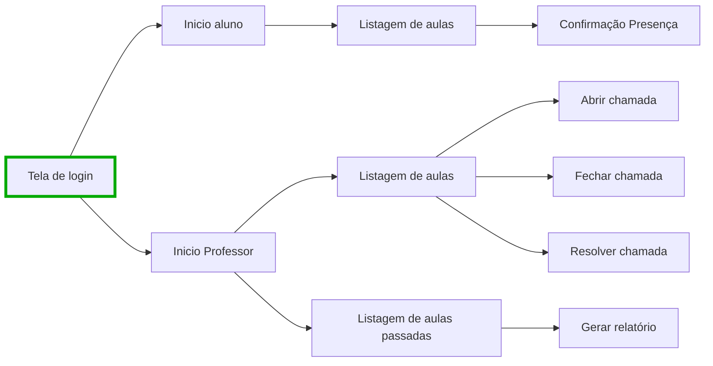

 <h1>SimplePresence core</h1>

<h3>
</h3>

Este repositório contem os codigos de teste e pre-alpha do SimplePresence. O codigo fonte do SimplePresence nao será disponibilizado por questoes de segurança e privacidade, entao este repositorio será o maximo de código sobre o SP disponibilizado open source. Caso queira saber mais sobre seu funcionamento, acesse o site ou mande um email com suas duvidas. 

## Client
---

